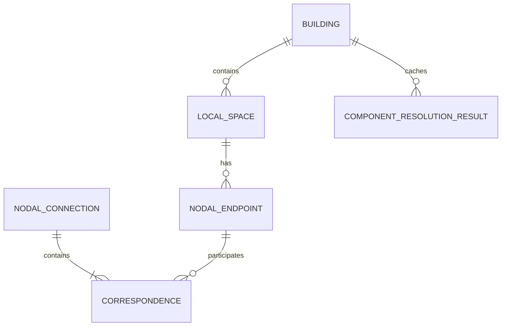

# Nodal Information / Spatial Resolution データモデル 設計メモ v2(2026-09-02)

本メモは、`ClaudeCode_指示書_NodalInformation_SpatialNetwork_IntegratedView_V2.md`
§5・§16(当初のER図・データモデル)を、実装完了後の監査結果に基づいて実装に
合わせて更新した確定版。旧文書は歴史的な実装指示書として残しているが、
データモデル・用語については本メモを正とする。

参照: `spatial_id_design_memo_v2.md`(Spatial State側の別のER、本メモの対象外)。

---

## 1. Building / LocalSpace / CoordinateDefinition

### Identity・Ownership・Codeの関係(確定)

- **space_id**: LocalSpaceの一意な識別子(identity)。`"{building_id}-{tokutei_code}"`形式で、グローバルに一意。
- **building_id**: Buildingへの所属(ownership)。
- **tokutei_code**: Building配下でのみ一意な識別コード。**グローバルな一意性は恒久設計にしない**(異なるbuildingが同じtokutei_codeを使ってよい)。

### 永続化(確定・完了)

| Entity | source of truth | ファイル |
|---|---|---|
| Building | `repositories.building_repository.BuildingRepository` | `backend/buildings.json` |
| LocalSpace | `repositories.local_space_repository.LocalSpaceRepository` | `backend/data/registry/local_spaces.json` |
| CoordinateDefinition | 上記から`space_id`で参照 | `backend/space_definitions/{space_id}.json`(正式) |

`backend/registry.py`(legacy)は両entityとも呼び出し元ゼロになったが、ロールバック用に削除せず残置している。

### CoordinateDefinition / Base Mapのファイルキー(2026-09-02変更)

正式な永続化キーは**space_id**。

- `space_definitions/{space_id}.json`、`base_maps/{space_id}{ext}`(+manifestの`id`もspace_id)が正式。
- `space_definitions/{tokutei_code}.json`、`base_maps/{tokutei_code}{ext}`(manifestの`id`がtokutei_code)は、**既存データ互換のためのread-onlyなlegacy fallback**。新規にはこちらへ書き込まない。
- 両方存在する場合は必ずspace_id側を優先する(`server._find_space_definition` / `server._find_base_map_path` / `LocalSpaceRepository._load_coordinate_definition`)。
- 既存実データ(G002/G003)は、`scripts/migrate_space_id_keyed_persistence.py --apply`により、tokutei_code単独キーのファイルを削除・変更せず、space_idキーのコピーを追加する形で移行済み。
- 将来的にlegacy fallbackを削除できるよう、新規書き込み経路はspace_idのみを使う一方向の移行構造にしてある(fallbackは読み取り専用、新規書き込み経路としては使用しない)。

### Placement(resolved placement)— 廃止

当初、LocalSpace 1件につきPlacement 1件を直接持たせる設計(`domain.local_space.Placement`/`PlacementStatus`、`LocalSpaceRepository.save_placement()`、`data/registry/placements.json`)を用意したが、実際のNodal Information解決パイプラインは一度もこれを呼ばず、常にUNRESOLVEDのまま死んでいた。**この経路は削除した。** resolved placementは下記2節の構造が正式仕様。

---

## 2. NodalEndpoint / NodalConnection(用語対応)

当初のER図(NODAL_POINT/NODAL_PAIR)と、実装済みの命名(`domain.nodal_endpoint`/`domain.nodal_connection`)の対応:

| 当初ER図 | 実装 | 備考 |
|---|---|---|
| NODAL_POINT | `NodalEndpoint` | `node_id`→`endpoint_id` |
| NODAL_POINT.scope | `NodalEndpoint.type`(`NodalEndpointType`) | 値は`LOCAL`/`GLOBAL`で同一 |
| NODAL_POINT.global_point | (無し) | GLOBAL側は`global_spatial_id`のみ保持し、物理座標キャッシュは意図的に持たない(2026-08-28決定) |
| NODAL_PAIR | `Correspondence`(`pair_id, node_a_id, node_b_id`) | フィールドは完全一致 |
| NODAL_CONNECTION | `NodalConnection` | ほぼ同一。`solution.residuals`が実装側の追加フィールド |
| (無し) | `SolutionStatus`(UNSOLVED/SOLVED/WARNING_HIGH_RESIDUAL/UNSOLVABLE) | 当初ER図はSOLVEDのみ言及 |

永続化: `backend/data/registry/nodal_endpoints.json`・`nodal_connections.json`(単純なJSON配列、フルCRUD)。NODAL_PAIR相当の`Correspondence`は`NodalConnection.correspondences`に埋め込みで、独立したテーブル/エンティティにはしない(当初ER図の`NODAL_CONNECTION ||--|{ NODAL_PAIR : contains`と一致)。

---

## 3. Component / 解決結果(resolved placementの正式構造)

当初のER図には無かったが、実装の中心的な中間概念として`Component`が存在する。

- **Component**: `NodalConnection`のグラフから動的に構築される、非永続の中間概念(`services/spatial_graph.py::build_components()`)。`component_id`は`min(member_space_ids)`から都度算出し、保存しない。
- **ComponentResolutionResult**: Component単位の最終解決結果(`local_placement: ComponentPlacementResult` + `global_resolution: ComponentGlobalResolution`)。**これが実際に永続化される唯一の「解決結果」。**
- 永続化先: `repositories.spatial_resolution_result_repository.SpatialResolutionResultRepository` → `backend/data/spatial_resolution_results/{building_id}.json`(building単位、`resolved_at`と共に丸ごと上書き)。

**source of truthの原則(確定)**: Nodal Information(`NodalEndpoint`/`NodalConnection`)がsource of truth。`ComponentResolutionResult`はそこから**derived/recomputable**なキャッシュであり、それ自体をsource of truthにしない。`NodalConnection`を変更したら`POST /api/spatial-resolution/resolve`で再計算する(自動再計算はしない、明示実行)。

---

## 4. Spatial State(参考、対象外)

Spatial State(占有状態)のER・データモデルは`spatial_id_design_memo_v2.md`が正。本メモの変更対象外(式・閾値・状態遷移は無変更)。
